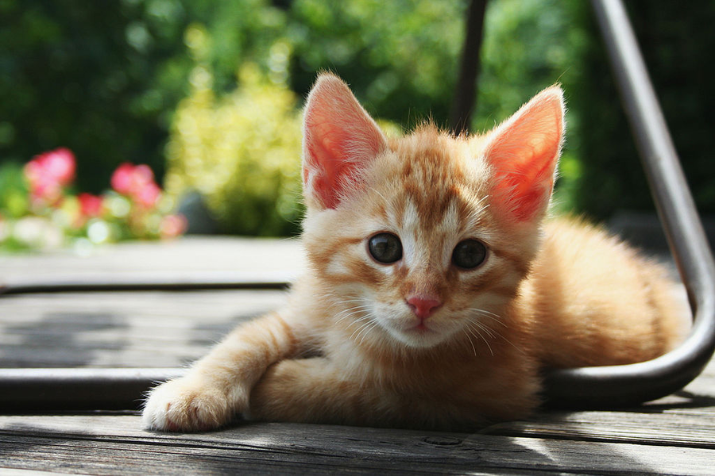
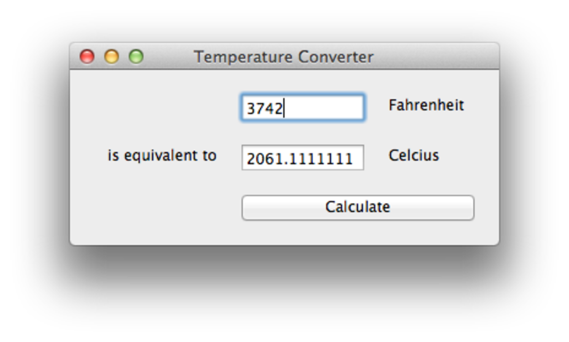

class: title

# Title Slide
## Author name

???

These are the speakers notes. They let the speaker know what they need to know. All work and no play makes jack a dull boy.

All work and no play makes jack a dull boy. All work and no play makes jack a dull boy. All work and no play makes jack a dull boy. All work and no play makes jack a dull boy. All work and no play makes jack a dull boy.

---

class: title

# This is a very long
# title slide with lots
# of text on it
## First Author name
## Second Author name
## Third Author name

---

# Title & Bullets

* Introduction
  - Subpoint
  - Subpoint
    + Subpoint
    + Subpoint
* Deep-dive
* Deep-dive
* ...

---

# Title & Numbers

1. Introduction
   1. Subpoint
   2. Subpoint
      1. Subpoint
      2. Subpoint
2. Deep-dive
3. Deep-dive
4. ...

---
# Incremental presentation

* Introduce

???

First bullet speaker notes.

--

* one

???

Second bullet speaker notes.

--

* bullet

???

Third bullet speaker notes, etc.

--

* point
--

* at
--

* a
--

* time

---

# Title & Bullets (2 col)

.left-column[

* Introduction with some very long text indeed
* Deep-dive
* Deep-dive
* Deep-dive
* ...

]

.right-column[

* Introduction with some very long text indeed
* Deep-dive
* Deep-dive
* Deep-dive
* ...
]

---



.footnotes[
commons.wikimedia.org/wiki/File:Red_Kitten_01.jpg
]

---
class: screenshot



# A screenshot

---
class: logo


---
# Quotation

> One thing was certain, that the white kitten had had nothing
> to do with it -- it was the black kitten's fault entirely. For
> the white kitten had been having its face washed by the old cat,
> for the last quarter of an hour (and bearing it pretty well,
> considering) so you see that it couldn't have had any hand in
> the mischief.

<cite>Lewis Carroll, Through the Looking Glass</cite>

---

# Code sample

```python
def greeting(arg):
    if arg == "hello":
        print("Hello World")
    else:
        print(arg)


class Something:
    def __init__(self, *args, **kwargs):
        super().__init__(*args, **kwargs)
```

---

# Footnotes

* First thing.dag1[]

* Second thing.dag2[]

* Third thing.dag3[]

* Last thing.dag4[]


.footnotes[

.dag1[] This isn't exactly what it sounds like. You need to consider this very carefully. And I mean _really_ carefully

.dag2[] Second dagger

.dag3[] Third dagger

.dag4[] Fourth dagger

]

---

# Formatting

* Something that is *important*, something that is **really important**, and something that is ***super important***.

* Something that ~~isn't important at all~~.

I am a very modern Major-General. I've information vegetable, animal and mineral. This text should run into multiple lines.

It will then start a new paragraph.

* And then go back into bullets, with a [link to somewhere else](https://beeware.org)

---

# Code in bullets

* Code that is `inline` with a bullet.

* Code in a bullet:

  ```python
  def greeting(arg):
      if arg == "hello":
          print("Hello World")
  ```
---
# Other inline content

* A quote in a bullet

    > To be, or not to be

    <cite>William Shakespeare</cite>

---
class: title reverse

# Point of emphasis

---
class: title

# Slide decks can also have animated transitions

---
class: title animated shake

## This is a
# shake
## transition
---
class: title animated bounce

## This is a
# bounce
## transition
---
class: title animated tada

## This is a
# tada
## transition
---
class: title animated swing

## This is a
# swing
## transition
---
class: title animated wobble

## This is a
# wobble
## transition
---
class: title animated pulse

## This is a
# pulse
## transition
---
class: title animated flash

## This is a
# flash
## transition

---
class: title animated flip

## This is a
# flip
## transition
---
class: title animated flipInX

## This is a
# flipInX
## transition
---
class: title animated flipInY

## This is a
# flipInY
## transition
---
class: title animated fadeIn

## This is a
# fadeIn
## transition
---
class: title animated fadeInUp

## This is a
# fadeInUp
## transition
---
class: title animated fadeInDown

## This is a
# fadeInDown
## transition
---
class: title animated fadeInLeft

## This is a
# fadeInLeft
## transition
---
class: title animated fadeInRight

## This is a
# fadeInRight
## transition
---
class: title animated bounceIn

## This is a
# bounceIn
## transition
---
class: title animated bounceInUp

## This is a
# bounceInUp
## transition
---
class: title animated bounceInDown

## This is a
# bounceInDown
## transition
---
class: title animated bounceInLeft

## This is a
# bounceInLeft
## transition
---
class: title animated bounceInRight

## This is a
# bounceInRight
## transition
---
class: title animated rotateIn

## This is a
# rotateIn
## transition
---
class: title animated rotateInUpLeft

## This is a
# rotateInUpLeft
## transition
---
class: title animated rotateInDownLeft

## This is a
# rotateInDownLeft
## transition
---
class: title animated rotateInUpRight

## This is a
# rotateInUpRight
## transition
---
class: title animated rotateInDownRight

## This is a
# rotateInDownRight
## transition

---
class: title animated rollIn

## This is a
# rollIn
## transition
---
class: title animated lightSpeedIn

## This is a
# lightSpeedIn
## transition
---
class: title

# And that's it!
